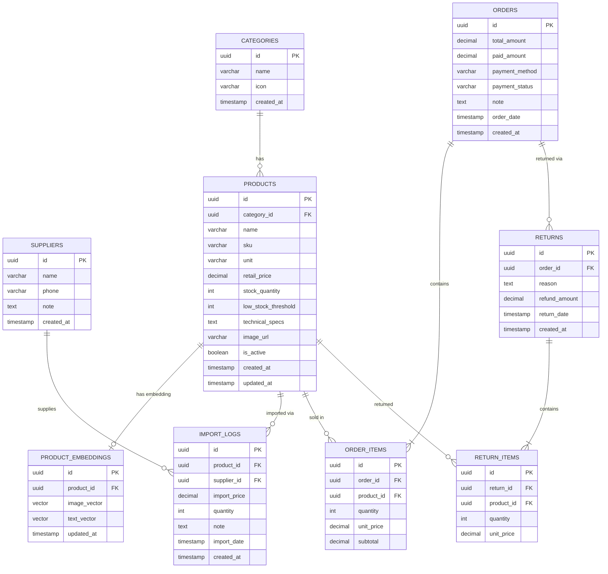

# ERD — Database Design
# Hệ thống Quản lý Cửa hàng Vật tư Gia đình

**Phiên bản:** 1.0 | **Ngày:** 2026-05-25 | **DB:** PostgreSQL 15 + pgvector (Supabase)

---

## 1. ERD Diagram



---

## 2. Mô tả chi tiết từng bảng

### 2.1 CATEGORIES — Ngành hàng

| Field | Type | Mô tả |
|---|---|---|
| `id` | UUID PK | Auto-generated |
| `name` | VARCHAR(100) | Tên ngành: Điện, Nước, Nhôm Kính, Xây dựng, Khác |
| `icon` | VARCHAR(50) | Tên icon (emoji hoặc icon name) |
| `created_at` | TIMESTAMP | Thời điểm tạo |

**Dữ liệu mẫu:** Điện ⚡, Nước 💧, Nhôm Kính 🪟, Xây dựng 🧱, Khác 📦

---

### 2.2 SUPPLIERS — Nhà cung cấp

| Field | Type | Mô tả |
|---|---|---|
| `id` | UUID PK | Auto-generated |
| `name` | VARCHAR(200) NOT NULL | Tên nhà cung cấp / đại lý |
| `phone` | VARCHAR(20) | Số điện thoại |
| `note` | TEXT | Ghi chú (địa chỉ, điều kiện mua...) |
| `created_at` | TIMESTAMP | Thời điểm tạo |

---

### 2.3 PRODUCTS — Sản phẩm

| Field | Type | Mô tả |
|---|---|---|
| `id` | UUID PK | Auto-generated |
| `category_id` | UUID FK → CATEGORIES | Ngành hàng |
| `name` | VARCHAR(300) NOT NULL | Tên sản phẩm đầy đủ |
| `sku` | VARCHAR(50) UNIQUE | Mã SKU tự gán (VD: DI-001, NU-015) |
| `unit` | VARCHAR(30) | Đơn vị: cái, mét, cuộn, kg, bộ... |
| `retail_price` | DECIMAL(12,0) NOT NULL | Giá bán lẻ (VNĐ) |
| `stock_quantity` | INT DEFAULT 0 | Số lượng tồn kho hiện tại |
| `low_stock_threshold` | INT DEFAULT 5 | Ngưỡng cảnh báo tồn thấp |
| `technical_specs` | TEXT | Thông số kỹ thuật (JSON hoặc text tự do) |
| `image_url` | VARCHAR(500) | URL ảnh trên Supabase Storage |
| `is_active` | BOOLEAN DEFAULT true | Sản phẩm còn kinh doanh không |
| `created_at` | TIMESTAMP | Thời điểm tạo |
| `updated_at` | TIMESTAMP | Lần cập nhật cuối |

**Indexes:**
- `idx_products_sku` ON `sku`
- `idx_products_category` ON `category_id`
- `idx_products_name` GIN (full-text search)

---

### 2.4 PRODUCT_EMBEDDINGS — Vector AI

| Field | Type | Mô tả |
|---|---|---|
| `id` | UUID PK | Auto-generated |
| `product_id` | UUID FK → PRODUCTS UNIQUE | 1 sản phẩm 1 embedding record |
| `image_vector` | VECTOR(768) | Embedding từ ảnh sản phẩm (Gemini embedding) |
| `text_vector` | VECTOR(768) | Embedding từ tên + thông số kỹ thuật |
| `updated_at` | TIMESTAMP | Lần cập nhật embedding |

**Index:** `idx_embedding_ivfflat` USING ivfflat ON `image_vector vector_cosine_ops`

*Khi thêm ảnh sản phẩm mới → backend tự tính embedding và lưu vào bảng này.*

---

### 2.5 IMPORT_LOGS — Lịch sử nhập hàng

| Field | Type | Mô tả |
|---|---|---|
| `id` | UUID PK | Auto-generated |
| `product_id` | UUID FK → PRODUCTS | Sản phẩm nhập |
| `supplier_id` | UUID FK → SUPPLIERS | Nhà cung cấp |
| `import_price` | DECIMAL(12,0) NOT NULL | Giá nhập lần này (VNĐ) |
| `quantity` | INT NOT NULL | Số lượng nhập |
| `note` | TEXT | Ghi chú (số hóa đơn NCC, lô hàng...) |
| `import_date` | TIMESTAMP NOT NULL | Ngày nhập thực tế |
| `created_at` | TIMESTAMP | Ngày ghi vào hệ thống |

**Indexes:** `idx_import_product_date` ON `(product_id, import_date DESC)`

*Append-only: không cập nhật, không xóa. Mỗi lần nhập = 1 dòng mới.*

---

### 2.6 ORDERS — Hóa đơn bán hàng

| Field | Type | Mô tả |
|---|---|---|
| `id` | UUID PK | Auto-generated |
| `total_amount` | DECIMAL(12,0) NOT NULL | Tổng tiền hóa đơn |
| `paid_amount` | DECIMAL(12,0) | Tiền khách đưa (tiền mặt) |
| `payment_method` | VARCHAR(20) | `cash` / `qr_transfer` |
| `payment_status` | VARCHAR(20) | `pending` / `paid` / `cancelled` / `returned` |
| `note` | TEXT | Ghi chú (tên khách, địa chỉ lắp...) |
| `order_date` | TIMESTAMP NOT NULL | Thời điểm tạo đơn |
| `created_at` | TIMESTAMP | Thời điểm ghi DB |

**Indexes:** `idx_orders_date` ON `order_date DESC`

**Ràng buộc:**
- Không có endpoint DELETE cho order có status = `paid` / `returned`
- Chỉ đổi `pending` → `paid` hoặc `pending` → `cancelled`

---

### 2.7 ORDER_ITEMS — Chi tiết hóa đơn

| Field | Type | Mô tả |
|---|---|---|
| `id` | UUID PK | Auto-generated |
| `order_id` | UUID FK → ORDERS | Hóa đơn chứa |
| `product_id` | UUID FK → PRODUCTS | Sản phẩm |
| `quantity` | INT NOT NULL | Số lượng bán |
| `unit_price` | DECIMAL(12,0) NOT NULL | Giá tại thời điểm bán (snapshot) |
| `subtotal` | DECIMAL(12,0) GENERATED | = quantity × unit_price |

---

### 2.8 RETURNS — Phiếu hoàn trả

| Field | Type | Mô tả |
|---|---|---|
| `id` | UUID PK | Auto-generated |
| `order_id` | UUID FK → ORDERS | Hóa đơn gốc |
| `reason` | TEXT | Lý do hoàn |
| `refund_amount` | DECIMAL(12,0) | Số tiền hoàn lại |
| `return_date` | TIMESTAMP NOT NULL | Ngày hoàn |
| `created_at` | TIMESTAMP | Thời điểm ghi |

### 2.9 RETURN_ITEMS — Chi tiết hoàn trả

| Field | Type | Mô tả |
|---|---|---|
| `id` | UUID PK | Auto-generated |
| `return_id` | UUID FK → RETURNS | Phiếu hoàn |
| `product_id` | UUID FK → PRODUCTS | Sản phẩm hoàn |
| `quantity` | INT NOT NULL | Số lượng hoàn |
| `unit_price` | DECIMAL(12,0) | Giá tại thời điểm hoàn |

---

## 3. Business Logic trên DB

### Trừ kho khi bán (Transaction)
```sql
BEGIN;
  -- 1. Tạo order
  INSERT INTO orders (...) VALUES (...) RETURNING id;
  -- 2. Tạo order_items
  INSERT INTO order_items (...) VALUES (...);
  -- 3. Trừ kho
  UPDATE products SET stock_quantity = stock_quantity - :qty
  WHERE id = :product_id AND stock_quantity >= :qty;
  -- Nếu update = 0 rows → ROLLBACK (không đủ hàng)
COMMIT;
```

### Cộng kho khi nhập hàng
```sql
BEGIN;
  INSERT INTO import_logs (...) VALUES (...);
  UPDATE products SET stock_quantity = stock_quantity + :qty WHERE id = :product_id;
COMMIT;
```

### Cộng kho khi hoàn trả
```sql
BEGIN;
  INSERT INTO returns + return_items ...;
  UPDATE products SET stock_quantity = stock_quantity + :qty ...;
  UPDATE orders SET payment_status = 'returned' WHERE id = :order_id;
COMMIT;
```

### Query lợi nhuận gộp ngày
```sql
SELECT
  SUM(oi.quantity * oi.unit_price) AS revenue,
  SUM(oi.quantity * (
    SELECT il.import_price FROM import_logs il
    WHERE il.product_id = oi.product_id
    ORDER BY il.import_date DESC LIMIT 1
  )) AS cost,
  SUM(oi.quantity * oi.unit_price) - SUM(oi.quantity * (...)) AS gross_profit
FROM orders o
JOIN order_items oi ON oi.order_id = o.id
WHERE o.payment_status = 'paid'
  AND o.order_date::date = CURRENT_DATE;
```

---

## 4. pgvector — AI Search

### Tạo extension
```sql
CREATE EXTENSION IF NOT EXISTS vector;
```

### AI Image Search Query
```sql
SELECT p.*, 1 - (pe.image_vector <=> :query_vector) AS similarity
FROM product_embeddings pe
JOIN products p ON p.id = pe.product_id
WHERE p.is_active = true
ORDER BY pe.image_vector <=> :query_vector
LIMIT 10;
```
